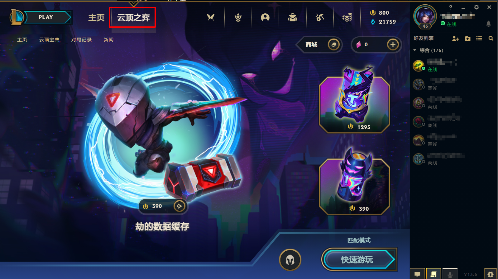
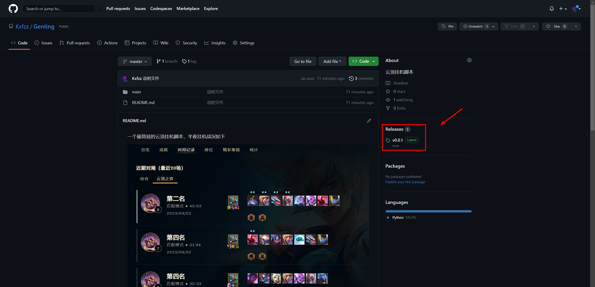

一个最简易的云顶挂机脚本，半夜挂机战况如下

<u>声明：tx私服慎用，懂的都懂</u>

桌面分辨率要设置成1920*1080   缩放125%
LOL客户端   1280*720      
进游戏后要设置成全屏或无边框

把页面放在云顶，然后启动脚本就行，就是Test.py这个文件，右键run。注意：<u>需要用管理员方式打开</u>，且要有Python环境，不想安装Python相关环境的话，我后面会发布一个exe文件，直接运行就行。

点到上图这个页面就可以启动脚本了

<u>管理员方式启动</u>

<u>管理员方式启动</u>

<u>管理员方式启动</u>

重要的事情说三次！！！！！！！！！！！！！！！！！！！

可以优化的点有很多，但是很懒不想弄了。

exe 文件如下位置

